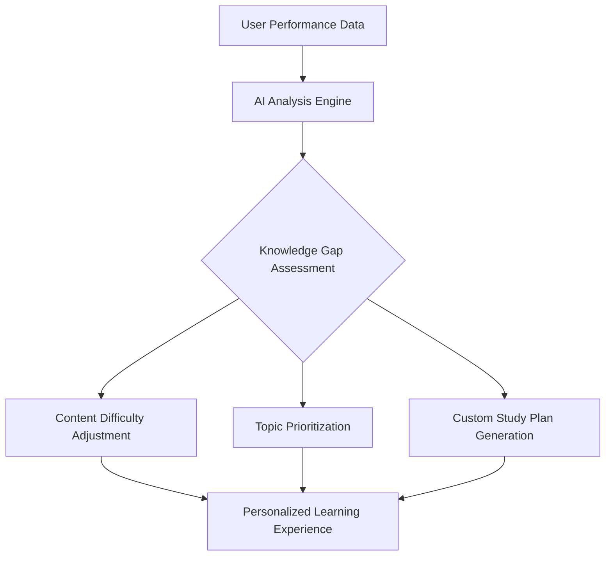
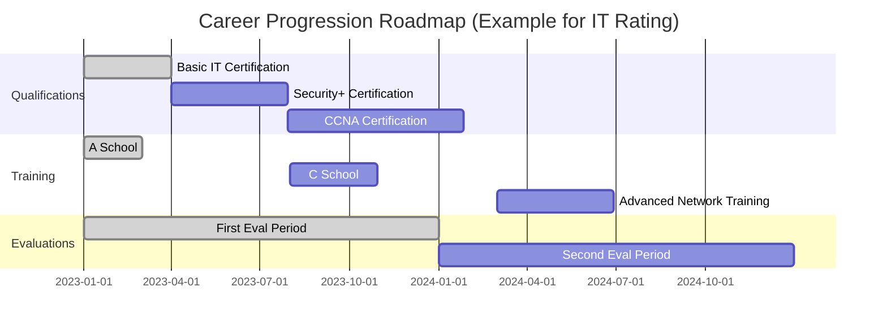

Based on my exploration, I now have a good understanding of the RankStudy application. It appears to be a comprehensive study and career development tool for Navy sailors, with several key features:

1. Flashcards and Quiz system for study
2. FMS (Fleet Management System) Calculator
3. Eval Template Builder for performance evaluations
4. Summarizer tool
5. Various other calculators (PMA, Award Points)

Now I can suggest additional study tools and addon features that would complement this application and maximize its educational value for sailors.

# Additional Study Tools and Addon Features for RankStudy

Based on my analysis of the RankStudy application, I can suggest several innovative addon tools and features that would enhance its educational value for sailors at various experience levels. These recommendations combine technological innovations with pedagogical approaches to create a more comprehensive learning experience.

## 1. Adaptive Learning System

**Feature:** Implement an AI-driven adaptive learning engine that personalizes study content based on individual performance.

**Benefits:**
- Identifies knowledge gaps and adjusts difficulty automatically
- Prioritizes content where the sailor needs more practice
- Optimizes study time by focusing on areas needing improvement
- Provides personalized learning paths for different career stages

**Implementation:**

## 2. Virtual Reality Training Scenarios

**Feature:** Create immersive VR simulations of shipboard environments and procedures.

**Benefits:**
- Provides hands-on practice for practical skills
- Simulates emergency scenarios safely
- Bridges the gap between theoretical knowledge and practical application
- Particularly valuable for technical ratings (engineering, damage control, etc.)

**Implementation:**
- Develop modular VR scenarios for different shipboard environments
- Include progressive difficulty levels
- Incorporate team-based scenarios for collaborative learning
- Provide performance metrics and improvement tracking

## 3. Spaced Repetition System (SRS)

**Feature:** Enhance the existing flashcard system with spaced repetition algorithms.

**Benefits:**
- Scientifically proven to improve long-term retention
- Automatically schedules reviews at optimal intervals
- Reduces forgetting curve and increases knowledge retention
- Particularly effective for terminology, regulations, and procedures

**Implementation:**
- Implement algorithms like SuperMemo or Anki's SM-2
- Track confidence ratings over time
- Visualize learning progress with retention graphs
- Allow customization of review intervals

## 4. Peer Learning Network

**Feature:** Create a secure, moderated platform for sailors to connect, share study materials, and form study groups.

**Benefits:**
- Facilitates knowledge sharing between experience levels
- Creates accountability through study partnerships
- Allows sailors to learn from peers in similar or aspirational roles
- Builds community and support networks

**Implementation:**
- Rating/rank-specific discussion forums
- Ability to share custom study materials
- Virtual study rooms with video/audio capabilities
- Mentorship matching system

## 5. Augmented Reality Reference Tool

**Feature:** Develop an AR application that overlays information on equipment or locations when viewed through a mobile device.

**Benefits:**
- Provides just-in-time learning in real environments
- Helps identify equipment and understand its function
- Assists with procedural tasks by showing step-by-step guides
- Reduces the learning curve for new equipment or environments

**Implementation:**
- Image recognition for equipment identification
- Procedural overlays for maintenance tasks
- Integration with technical manuals and documentation
- Offline mode for use in limited-connectivity environments

## 6. Career Progression Roadmap

**Feature:** Create interactive career progression visualizations with required qualifications, training, and milestones.

**Benefits:**
- Clarifies advancement requirements for each rating
- Helps sailors plan their career development
- Identifies critical qualifications and training opportunities
- Provides a clear path from current position to career goals

**Implementation:**

## 7. Simulation-Based Assessment

**Feature:** Create scenario-based assessments that test application of knowledge rather than just recall.

**Benefits:**
- Evaluates critical thinking and decision-making
- Tests practical application of knowledge
- Prepares sailors for real-world situations
- Provides more meaningful feedback than traditional quizzes

**Implementation:**
- Branching scenario simulations
- Decision point evaluations
- Consequence-based feedback
- Integration with learning objectives

## 8. Mobile Microlearning Modules

**Feature:** Develop bite-sized learning modules optimized for mobile consumption during short breaks.

**Benefits:**
- Enables learning during "dead time" in a sailor's day
- Increases engagement through short, focused content
- Improves accessibility of learning materials
- Supports continuous learning habits

**Implementation:**
- 3-5 minute focused learning modules
- Push notifications for scheduled learning
- Offline access for learning without connectivity
- Progress synchronization across devices

## 9. AI-Powered Study Assistant

**Feature:** Implement a conversational AI assistant that can answer questions, explain concepts, and provide study guidance.

**Benefits:**
- Provides 24/7 access to learning support
- Answers specific questions about Navy regulations, procedures, etc.
- Helps clarify difficult concepts through dialogue
- Offers personalized study recommendations

**Implementation:**
- Natural language processing for question understanding
- Integration with Navy knowledge base
- Personalization based on user history and preferences
- Continuous improvement through user interactions

## 10. Performance Analytics Dashboard

**Feature:** Create comprehensive analytics that track study habits, performance trends, and knowledge retention.

**Benefits:**
- Provides insights into effective study strategies
- Identifies trends in performance over time
- Helps sailors understand their learning patterns
- Enables data-driven study planning

**Implementation:**
- Visual representations of study data
- Comparative analysis against goals
- Predictive models for advancement readiness
- Customizable reporting options

## 11. Collaborative Knowledge Base

**Feature:** Develop a wiki-style knowledge repository that sailors can contribute to and maintain.

**Benefits:**
- Captures tribal knowledge not found in official documentation
- Creates a living document that evolves with changes
- Encourages knowledge sharing across experience levels
- Provides practical insights beyond textbook information

**Implementation:**
- Rating-specific sections with moderation
- Citation requirements for factual claims
- Version history and change tracking
- Integration with official Navy resources

## 12. Gamified Learning Challenges

**Feature:** Implement competitive and collaborative challenges with rewards and recognition.

**Benefits:**
- Increases motivation through friendly competition
- Provides external incentives for consistent study
- Creates engaging learning experiences
- Builds camaraderie through team challenges

**Implementation:**
- Daily/weekly/monthly challenges
- Leaderboards and achievement badges
- Team-based competitions
- Real or virtual rewards for accomplishments

## Conclusion

These addon features would transform RankStudy from a traditional study application into a comprehensive career development platform for sailors. By combining technological innovations with sound pedagogical approaches, the application can address different learning styles, experience levels, and career goals.

The most effective implementation strategy would be to prioritize features based on:
1. User feedback from current sailors
2. Technical feasibility and integration complexity
3. Alignment with Navy training objectives
4. Potential impact on advancement success rates

By gradually introducing these features, RankStudy can evolve into an indispensable resource that supports sailors throughout their entire Navy career, from recruitment through retirement.